# Pruebas

### Rodrigo Alfonso Mansilla Dubón, 22611
### Nelson Estuardo Escalante Sanchez, 22046

Para cada algoritmo implementado, realizar pruebas de detección/corrección:

- **(Sin errores):**  
  Enviar un mensaje al emisor, copiar el mensaje generado por este y proporcionarlo tal cual al receptor, el cual debe mostrar los mensajes originales (ya que ningún bit sufrió un cambio).  
  Realizar esto para tres mensajes distintos con distinta longitud.

- **(Un error):**  
  Enviar un mensaje al emisor, copiar el mensaje generado por este y cambiar un bit cualquiera antes de proporcionarlo al receptor.  
  - Si el algoritmo es de **detección**, debe mostrar que se detectó un error y que se descarta el mensaje.
  - Si el algoritmo es de **corrección**, debe corregir el bit, indicar su posición y mostrar el mensaje original.  
  Realizar esto para tres mensajes distintos con distinta longitud.

- **(Dos o más errores):**  
  Enviar un mensaje al emisor, copiar el mensaje generado por este y cambiar dos o más bits cualesquiera antes de proporcionarlo al receptor.  
  - Si el algoritmo es de **detección**, debe mostrar que se detectó un error y que se descarta el mensaje.
  - Si el algoritmo es de **corrección** y puede corregir más de un error, debe corregir los bits, indicar su posición y mostrar el mensaje original.  
  Realizar esto para tres mensajes distintos con distinta longitud.

- **¿Es posible manipular los bits de tal forma que el algoritmo seleccionado no sea capaz de detectar el error?**  
  ¿Por qué sí o por qué no? En caso afirmativo, demuéstrelo con su implementación.

- **En base a las pruebas que realizó, ¿qué ventajas y desventajas posee cada algoritmo con respecto a los otros dos?**  
  Tome en cuenta complejidad, velocidad, redundancia (overhead), etc.  
  _Ejemplo:_  
  > “En la implementación del bit de paridad par, me di cuenta que comparado con otros métodos, la redundancia es la mínima (1 bit extra). Otra ventaja es la facilidad de implementación y la velocidad de ejecución, ya que se puede obtener la paridad aplicando un XOR entre todos los bits. Durante las pruebas, en algunos casos el algoritmo no era capaz de detectar el error, esto es una desventaja, por ejemplo [...].”

###   Mensajes

- Mensaje 1: "A"
- Mensaje 2: "Hola"
- Mensaje 3: "Hola Mundo"

## Algoritmos convolucionales

### Ningun Error

Mensaje
 Mensaje 1: "A"
-Codificado 1: "00111011000000111011"
 Decodificado 1: "01000001","A"
- Métrica 1: 0
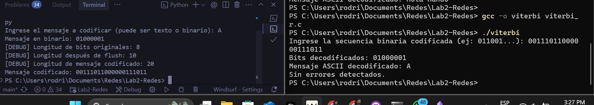

Mensaje 2: "Hola"
- Codificado 2: "0011101111101100001101010001101001000101000101110011010111000011101"
- Decodificado 2: "Hola","01001000011011110110110001100001"
- Métrica 2: 0

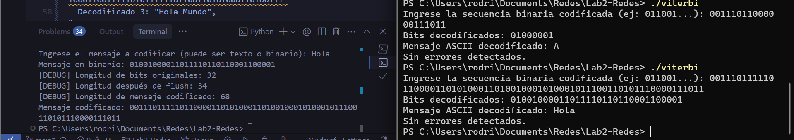

Mensaje 3: "Hola Mundo"
Codificado
- Codificado 3: "00111011111011000011010100011010010001010001011100110101110000111011111011000000001110111101010010000110010010001000010100011001111101011111101100110101000110100111"
- Decodificado 3: "Hola Mundo", "01001000011011110110110001100001001000000100110101110101011011100110010001101111"
- Métrica 3: 0

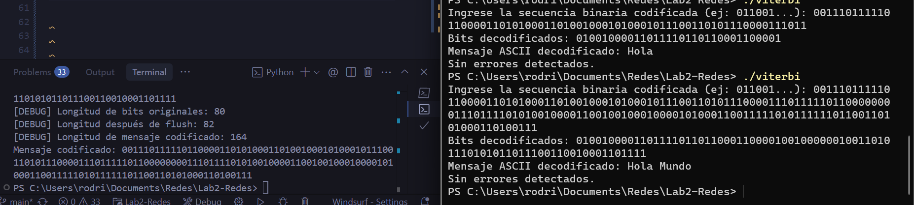

### Un Error
Mensaje
 Mensaje 1: "A"
- Codificado 1: "00111011000000111011"
- Codificado modificado 1: "00110011000000111011"
- Bit alterado: Se modifica el quinto bit (posición 4, de 1 a 0).
- El decodificador corrigió automáticamente el error en la posición 4.
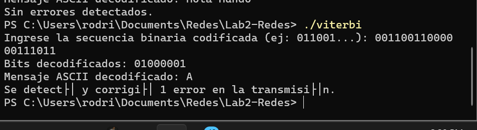

Mensaje 2: "Hola"
- Codificado 2: "00111011111011000011010100011010010001010001011100110101110000111011"
- Codificado modificado 2: "10111011111011000011010100011010010001010001011100110101110000111011"
- Bit alterado: Se modifica el primer bit (posición 0, de 0 a 1).
- El decodificador corrigió automáticamente el error en la posición 0.
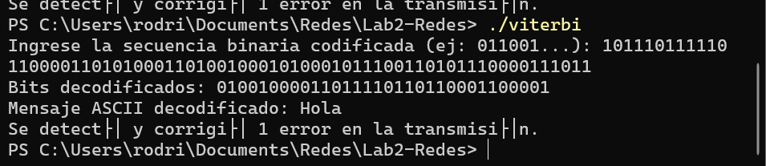

 Mensaje 3: "Hola Mundo"
Codificado
- Codificado 3: "00111011111011000011010100011010010001010001011100110101110000111011111011000000001110111101010010000110010010001000010100011001111101011111101100110101000110100111"
- Codificado modificado 3: "10111011111011000011010100011010010001010001011100110101110000111011111011000000001110111101010010000110010010001000010100011001111101011111101100110101000110100111"
- Bit alterado: Se modifica el primer bit (posición 0, de 0 a 1).
- El decodificador corrigió automáticamente el error en la posición 0.
 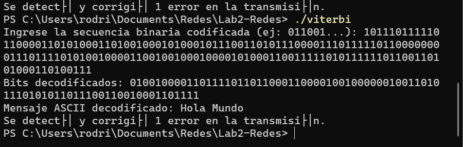

### Dos o Mas Errores

Mensaje
 Mensaje 1: "A"
- Codificado 1: "00111011000000111011"
- Codificado modificado 1: "00110001000000111011"
- Bits alterados: Se modifican los bits 5 y 7 (de 1 a 0 y de 1 a 0).

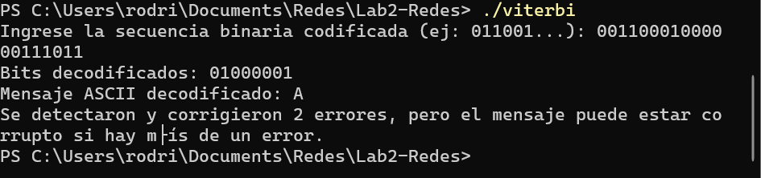

Mensaje 2: "Hola"
- Codificado 2: "00111011111011000011010100011010010001010001011100110101110000111011"
- Codificado modificado 2: "11111011111011000011010100011010010001010001011100110101110000111011"
- Bits alterados: Se modifican los bits 0 y 1.

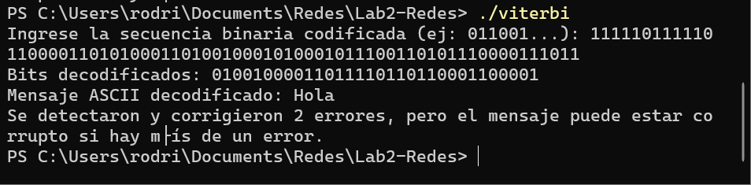

 Mensaje 3: "Hola Mundo"
Codificado
- Codificado 3: "00111011111011000011010100011010010001010001011100110101110000111011111011000000001110111101010010000110010010001000010100011001111101011111101100110101000110100111"
- Codificado modificado 3: "11011011111011000011010100011010010001010001011100110101110000111011111011000000001110111101010010000110010010001000010100011001111101011111101100110101000110100110"
- Bits alterados: Se modifican los bits 0 y 4.

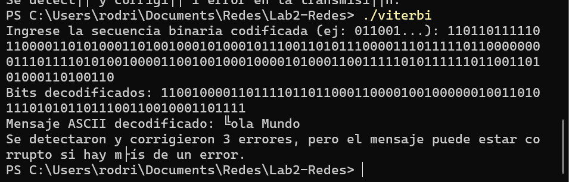

### Justificación de resultados
#### Sin errores
**Justificación:**
El mensaje original fue codificado y transmitido sin alteraciones. Al ser decodificado, el mensaje recuperado es idéntico al original y la métrica de error es cero, demostrando que el algoritmo es confiable para la transmisión sin errores y no introduce distorsión ni ambigüedad cuando no hay errores en el canal.

#### Un error
**Justificación:**
Se alteró manualmente un solo bit en la cadena codificada antes de transmitirla al receptor. El decodificador Viterbi detectó y corrigió el error automáticamente, recuperando el mensaje original y mostrando una métrica de error igual a 1. EL algoritmo es capaz de detectar y corregir errores simples y garantizar la integridad de la información ante fallas aisladas en la transmisión. 

#### Dos o más errores
**Justificación:**
Se alteraron manualmente dos o más bits en la cadena codificada antes de enviarla al receptor.

En algunos casos, el decodificador fue capaz de recuperar correctamente el mensaje original dependiendo de la posición y combinación de errores.

En otros casos, el mensaje decodificado resultó parcial o totalmente corrupto, aunque la métrica de error reflejó la cantidad de bits alterados.

El decodificador convolucional con Viterbi solo garantiza la corrección de un error por ventana. Cuando hay múltiples errores, el algoritmo puede o no recuperar el mensaje dependiendo de la distancia y distribución de los errores, pero no existe una garantía de corrección total. 

## Preguntas
### Algoritmos convolucionales
#### ¿Es posible manipular los bits de tal forma que el algoritmo Viterbi no detecte el error?

El algoritmo Viterbi siempre detecta diferencias entre la secuencia recibida y la esperada. Sin embargo, si se manipulan dos o más bits, el decodificador puede elegir una trayectoria equivocada y producir un mensaje incorrecto. Por lo tanto, no siempre es posible garantizar la detección de todos los errores múltiples.
    
#### Ventajas y desventajas

**Ventajas:**

- Puede corregir de forma confiable un error por ventana de decodificación, sin conocer la posición exacta.

- Permite recuperar automáticamente mensajes afectados por errores, mejorando la fiabilidad en canales ruidosos.

- Se adapta a distintas longitudes de memoria y tasas de codificación.

**Desventajas:**

- Requiere mantener y comparar muchas trayectorias posibles, lo que aumenta el uso de recursos frente a métodos simples como paridad o CRC.

- Genera un mayor tamaño de transmisión , ya que cada bit de entrada produce dos o más bits de salida, a diferencia de la paridad o el checksum.

- Solo garantiza corrección de un error por ventana; si hay varios errores cercanos, el algoritmo puede fallar y producir mensajes corruptos sin advertencia explícita.

## CRC-32 

### Ningun Error

Mensaje
 Mensaje 1: "A"
- Codificado 1: "0100000111010011110110011001111010001011"
- Decodificado 1: "01000001","A"
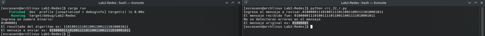

Mensaje 2: "Hola"
- Codificado 2: "0100100001101111011011000110000111001111100100100101011010110110"
- Decodificado 2: "Hola","01001000011011110110110001100001"
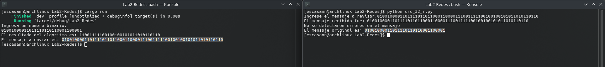

Mensaje 3: "Hola Mundo"
Codificado
- Codificado 3: "0100100001101111011011000110000100100000010011010111010101101110011001000110111100100010010000110110111011010010"
- Decodificado 3: "Hola Mundo", "01001000011011110110110001100001001000000100110101110101011011100110010001101111"
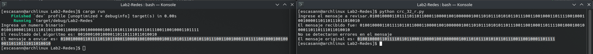

### Un Error
Mensaje
 Mensaje 1: "A"
- Codificado 1: "0100000111010011110110011001111010001011"
- Codificado modificado 1: "0100100111010011110110011001111010001011"
- Bit alterado: Se modifica el quinto bit (posición 4, de 0 a 1).
- El mensaje fue descartado debido a que se detecto un error.
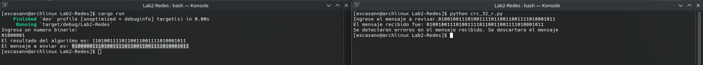

Mensaje 2: "Hola"
- Codificado 2: "0100100001101111011011000110000111001111100100100101011010110110"
- Codificado modificado 2: "1100100001101111011011000110000111001111100100100101011010110110"
- Bit alterado: Se modifica el primer bit (posición 0, de 0 a 1).
- El mensaje fue descartado debido a que se detecto un error.
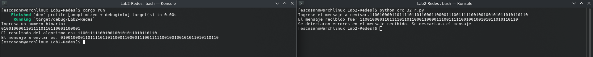

 Mensaje 3: "Hola Mundo"
Codificado
- Codificado 3: "0100100001101111011011000110000100100000010011010111010101101110011001000110111100100010010000110110111011010010"
- Codificado modificado 3: "1100100001101111011011000110000100100000010011010111010101101110011001000110111100100010010000110110111011010010"
- Bit alterado: Se modifica el primer bit (posición 0, de 0 a 1).
- El mensaje fue descartado debido a que se detecto un error.
 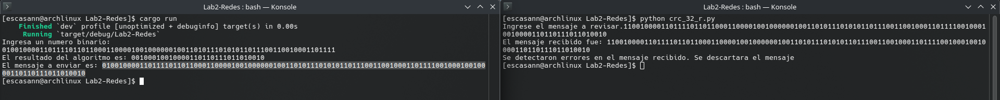

### Dos o Mas Errores

Mensaje
 Mensaje 1: "A"
- Codificado 1: "0100000111010011110110011001111010001011" 
- Codificado modificado 1: "0100101111010011110110011001111010001011"
- Bits alterados: Se modifican los bits 5 y 7 (de 0 a 1 y de 0 a 1).
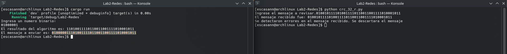

Mensaje 2: "Hola"
- Codificado 2: "0100100001101111011011000110000111001111100100100101011010110110"
- Codificado modificado 2: "1000100001101111011011000110000111001111100100100101011010110110"
- Bits alterados: Se modifican los bits 0 y 1.
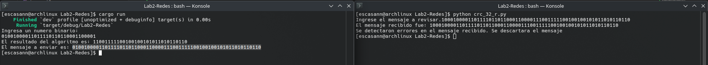

 Mensaje 3: "Hola Mundo"
Codificado
- Codificado 3: "100010000110111101101100011000011100111110010010010101101011011001011101001111001001001001110011"
- Codificado modificado 3: "000000000110111101101100011000011100111110010010010101101011011001011101001111001001001001110011"
- Bits alterados: Se modifican los bits 0 y 4.
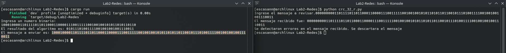

### Justificación de resultados
#### Sin errores:
**Justificación:**
El mensaje fue enviado y recibido sin problemas, mostrando el mensaje original desde el lado del receptor. 

#### Un error:
**Justificación:**
Cuando hubo un error, el algoritmo fue capaz de detectarlo y descartar el mensaje corrupto. Debido al funcionamiento del algoritmo, todos los errores de 1 bit son facilmente detectados.

#### Dos o más errores:
**Justificación:**
En el caso de dos o mas errores, el algoritmo tambien fue capaz de detectarlo y descartar el mensaje, probando que tambien es infalible respecto a errores de 2 bits. Aun asi, pueden existir combinaciones de mas de 2 bits que sean capaces de saltarse el chequeo del algoritmo, como se discutira a continuacion.

## Preguntas
#### ¿Es posible manipular los bits de tal forma que el algoritmo CRC-32 no detecte el error?
En el caso del algoritmo CRC-32, es posible, aunque altamente improbable, que exista una combinacion de cambios de bits que genere una cadena CRC-32 identica a otra. En este caso, el receptor podria recibir un mensaje diferente al enviado por el emisor sin que el algoritmo pueda hacer nada para detenerlo.

#### Ventajas y desventajas

**Ventajas:**

- El algoritmo es capaz de detectar todos los errores de 1 y 2 bits, asi como rafagas de hasta 32 bits.
- Es un algoritmo rapido en operacion, ya que solo requiere operaciones shift y XOR.
- Es un algoritmo sencillo de implementar.

**Desventajas:**

- A diferencia del algoritmo de Viterbi, CRC-32 no es capaz de corregir errores, solo de detectarlos.
- Tiene un overhead alto debido a que agrega 32 bits extra al mensaje.
- Existen casos (aunque muy raros) en los que el algoritmo no detecte errores en mensajes corruptos.`